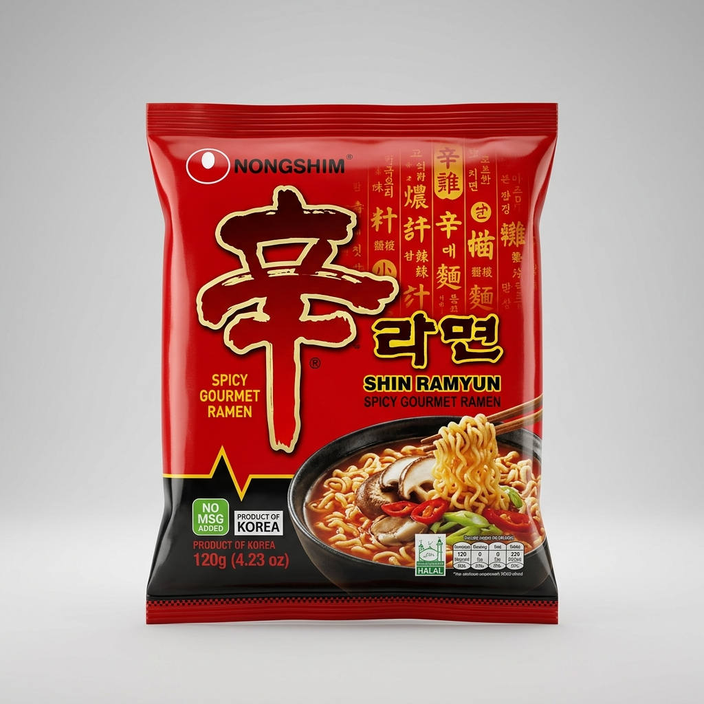
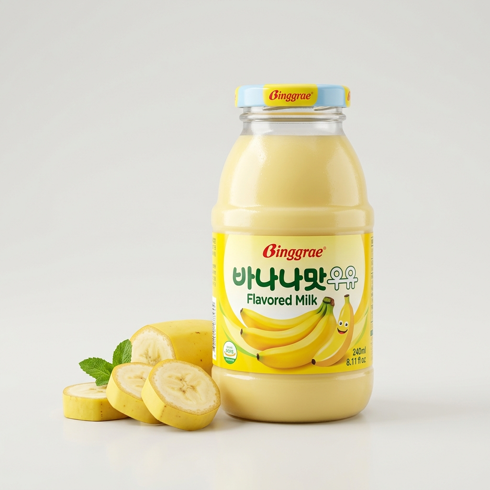
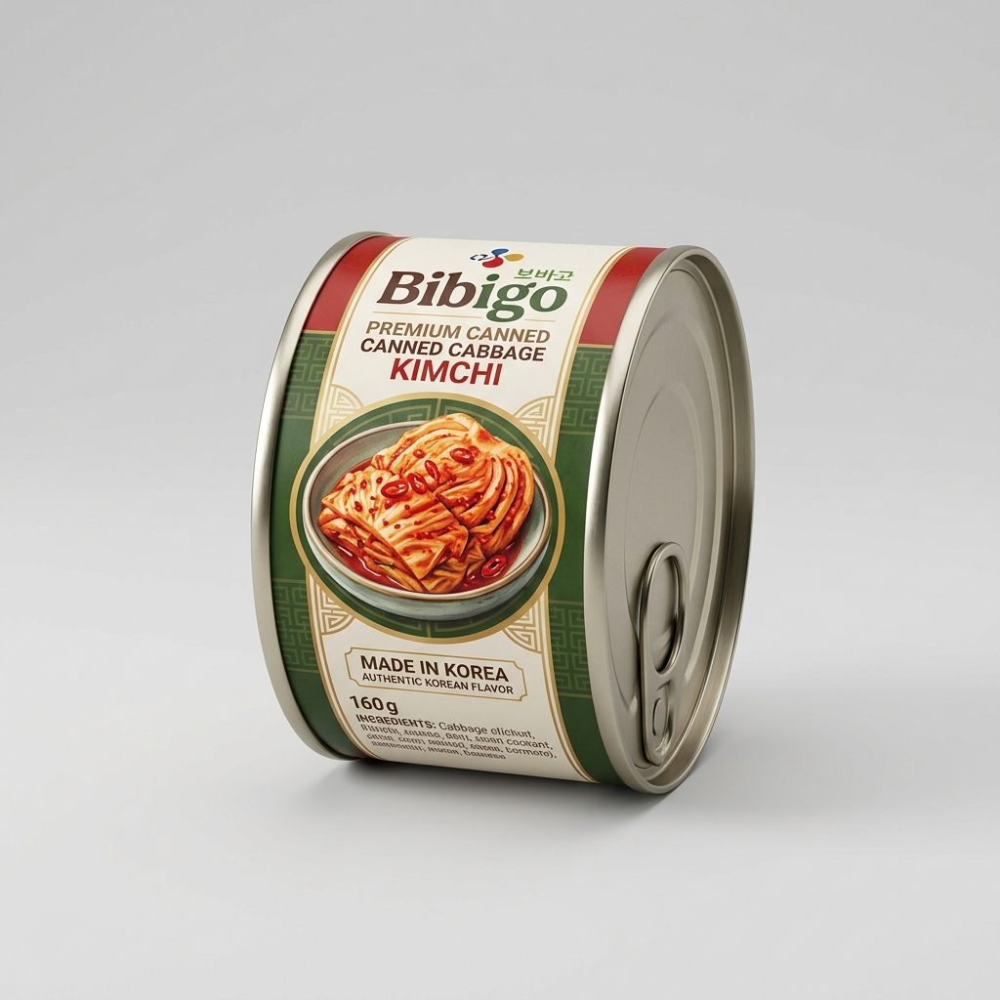
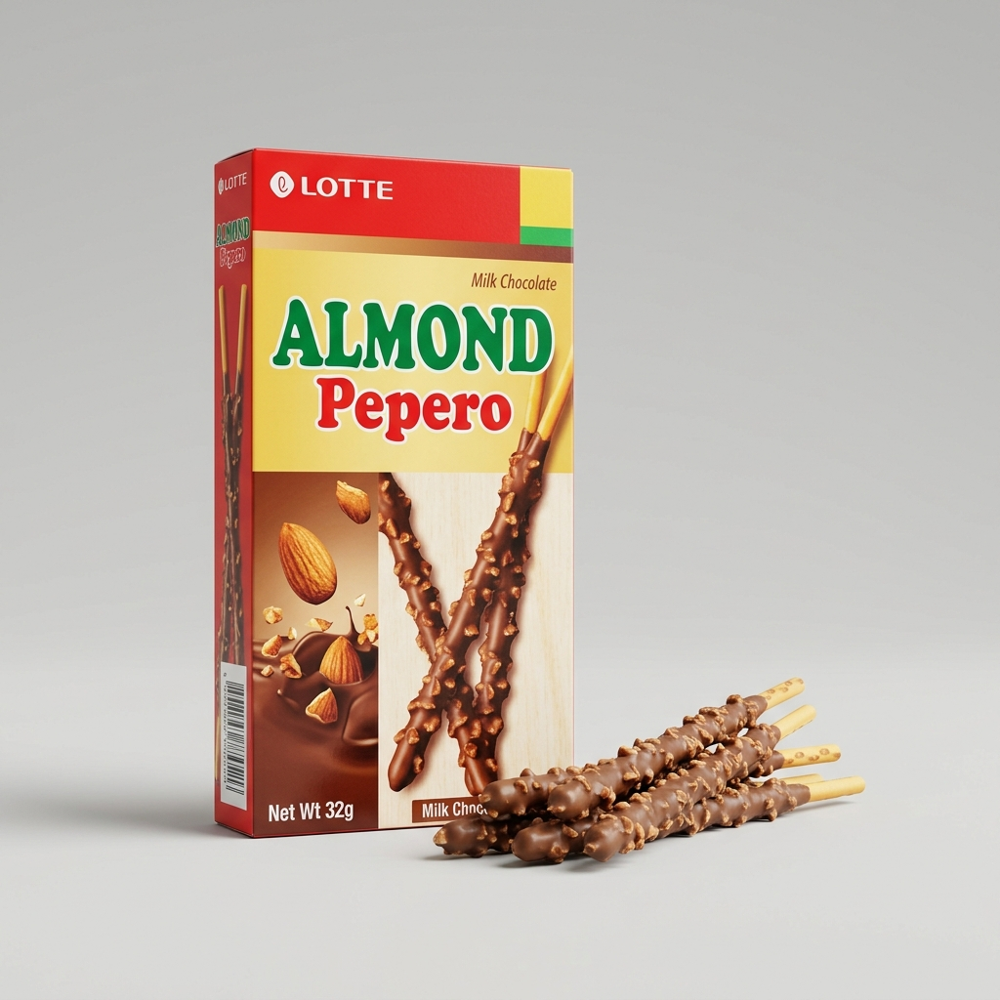
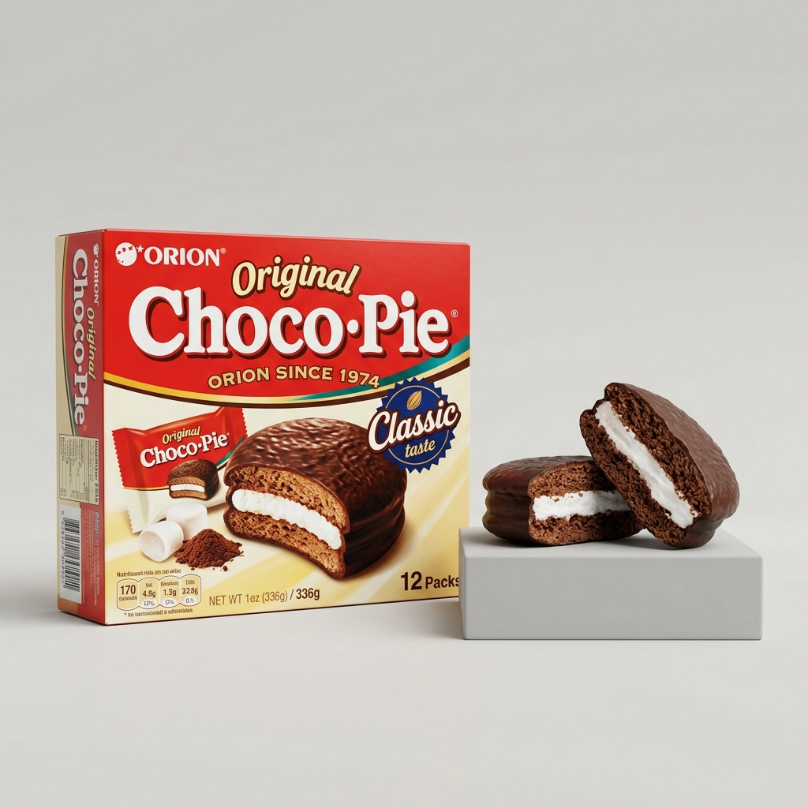

# 🍙 Haru Mart (하루 마트) | Premium Korean Packaged Food Store

[](https://harumartkoreansnackswebsite.vercel.app/)
[](https://github.com/naziashakil27/harumartkoreansnackswebsite)

An immersive, highly animated, and beautifully designed single-page Korean convenience store storefront. Browse popular snacks, instant ramyuns, nostalgia-filled drinks, and organic pantry items curated directly from Seoul.

<p align="center">
  
</p>

---

## ✨ Features

- **🎨 Modern Glassmorphic UI:** A premium, translucent UI system styled with a tailored warm cream and lavender color palette.
- **🌙 Fluid Dark Mode:** Easily transition between light cream mode and dark charcoal mode with a toggle.
- **✨ Custom Desktop Cursor:** Interactive custom cursor dot with a smooth GSAP-trailing outer ring that scales up on link/button hovers.
- **🛒 Dynamic Cart & Sliding Drawer:** Real-time quantity calculator, free shipping progress bar trigger ($30 threshold), and side-drawer slide animation.
- **💖 Interactive Saved Shelf:** Bookmark favorite snacks directly to a local React-state wishlist.
- **⚡ GSAP Micro-Animations:** Responsive cards that hover-lift, float, and react naturally to user interaction.
- **🔍 Full Search & Multi-Filter System:** Filter products instantly by aisle category, budget caps, rating tiers, and search queries.

---

## 📦 Curated Snack Inventory

Here are the premium items available in the store, complete with custom high-fidelity packshots:

| Product Packshot | Item Name | Category | Description |
| :---: | :--- | :---: | :--- |
|  | **Shin Ramyun Spicy Ramen** | Noodles | Chewy noodles combined with a spicy, rich beef broth infused with aromatic mushrooms and garlic. |
|  | **Honey Butter Potato Chips** | Snacks | Crispy, thin potato chips glazed with rich French butter and sweet acacia honey. |
|  | **Binggrae Banana Milk** | Drinks | Nostalgic jar-shaped bottle combining premium dairy with sweet, smooth banana juice. |
|  | **Bibigo Canned Kimchi** | Pantry | Tangy fermented Napa cabbage kimchi in a convenient, odor-proof travel can. |
|  | **Lotte Almond Pepero Sticks** | Snacks | Crispy biscuit sticks dipped in milk chocolate and rolled in roasted crushed almonds. |
|  | **Yopokki Tteokbokki Cup** | Ready Meals | Chewy cylindrical rice cakes paired with a sweet and mildly spicy chili gochujang sauce. |
|  | **Orion Original Choco Pie** | Snacks | Fluffy marshmallow filling sandwiched between soft biscuit cakes and coated in chocolate. |
|  | **Lotte Milkis Yogurt Soda** | Drinks | A carbonated milk beverage merging the fizz of soda with the creamy finish of yogurt. |

---

## 🛠️ Technology Stack

The application is built using a modern, fast client-side architecture that runs natively in any standard browser:

- **Library:** [React](https://react.dev/) (loaded lightweight via CDN)
- **Styling:** [Tailwind CSS v3](https://tailwindcss.com/)
- **Animations:** [GSAP (GreenSock)](https://greensock.com/gsap/) for high-performance timeline micro-interactions
- **Icons:** [Lucide Icons](https://lucide.dev/)
- **Compilation:** [Babel Standalone](https://babeljs.io/) for on-the-fly JSX transpilation (ideal for static page deployment)

---

## 🚀 Getting Started Locally

You can launch and preview the storefront locally using two methods:

### Option 1: Native Python Web Server (Recommended)
This method is pre-configured and does not require Node.js or packages installation:
```bash
python serve.py
```
This runs a local HTTP server on port `8000` and automatically launches your default web browser to:
[http://localhost:8000/](http://localhost:8000/)

### Option 2: Vite Development Server
If you have Node.js installed and want hot-reloading:
```bash
npm install
npm run dev
```

---

## 🌐 Live Deployments

- **Live URL:** [https://harumartkoreansnackswebsite-lime.vercel.app/](https://harumartkoreansnackswebsite-lime.vercel.app/)
- **GitHub Repository:** [https://github.com/naziashakil27/harumartkoreansnackswebsite](https://github.com/naziashakil27/harumartkoreansnackswebsite)